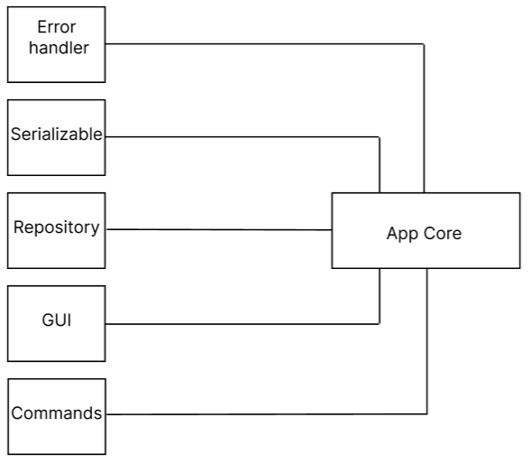
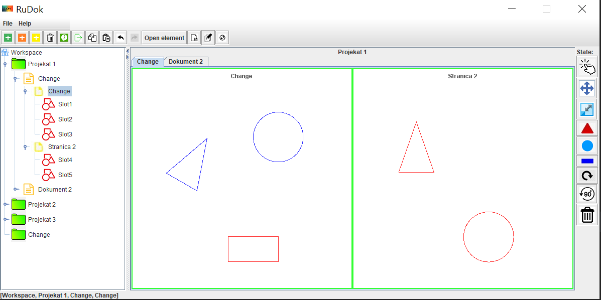

# RuDok

RuDok is a document manager written in java.
Rudok's architecture is component based. All components are shown in the picture below:

Several design patterns were used in this project including: Observer, State, MVC, Command, Singleton, Factory

With RuDok user can:

1. Create, delete and edit documents, pages and slots (A slot is a shape where the user can store images or text).
2. Multiselect slots and move them on the screen, change their size, delete, rotate ...
3. Save his work before he closes the program.
4. Undo and Redo an action.
5. Open existing documents from his computer.
6. Copy a page from one document to another.

